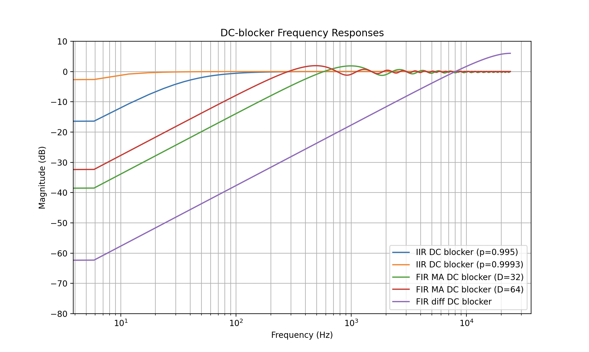

A lot of time has passed between finish the last lab and starting this one. The main culprit being Oppenheim and Schafer's Discrete-Time Signal Processing book. When I first read the names of the functions from CMSIS-DSP, I only recognized FIR and IIR, I didn't know how to design either of them, what the implementation topologies where and why should one use one instead of the other. The book covers all those aspects very deeply, another interesting topic I found was the effect of quantization on filter coefficients. The deep dive ended up taking a few months, partly due to the missing prerequisites that I had to cover in order to understand some of the intricate parts that were being covered.

After the deep dive was done, I was well-equipped to tackle this design problem, try different filters out, tweak them a bit, and pick the best one in the end. As Oppenheim kept saying in his lectures, "Any filter is optimal given the correct criteria", and "The buck stops with the designer". I first plotted the freq response of the filter that was used in lab 2 and was horrified by how the differentiator filter basically attenuated all the relevant frequencies(check the image below) for human speech significantly. I then saw a comparison on the lcavlabs website of the before and after waveforms of a speech file, the filtered waveform bares little resemblance to the original one. I then repurposed the script on the website to try out various filters and compare waveforms and how they sound to find the perfect lightweight DC Blocker(Check the python notebook for pictures).

The final two contenders were a 2nd Order Butterworth filter I designed with scipy and a leaky integrator with the pole very close to the unit circle. Apparently the filter performance is very sensitive to the location of the pole, so it might be better to use the Butterworth filter when using fixed point arithmetic. Although the Butterworth filter had much better attenuation(as seen the picture above), it has a worse frequency response. I suspect that both would have fared just fine, since the non-linearity is pushed very close to the low end of the range(Check the next picture).

